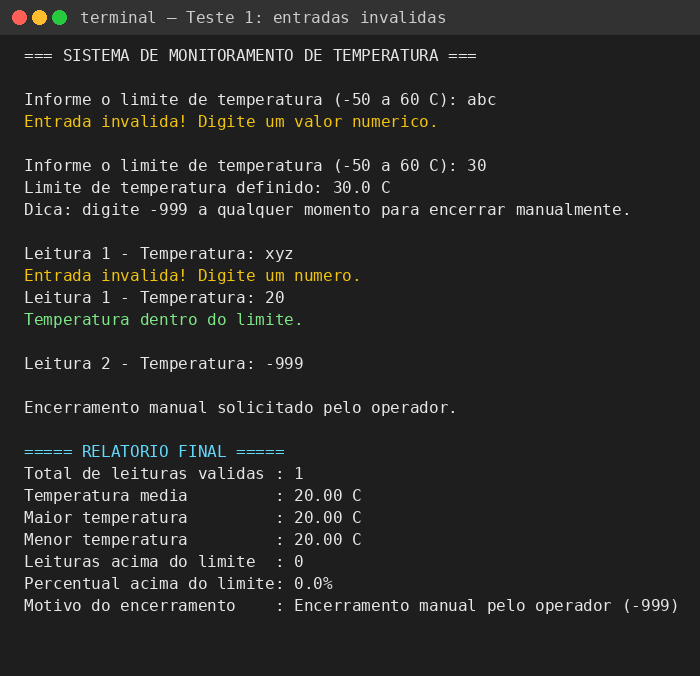
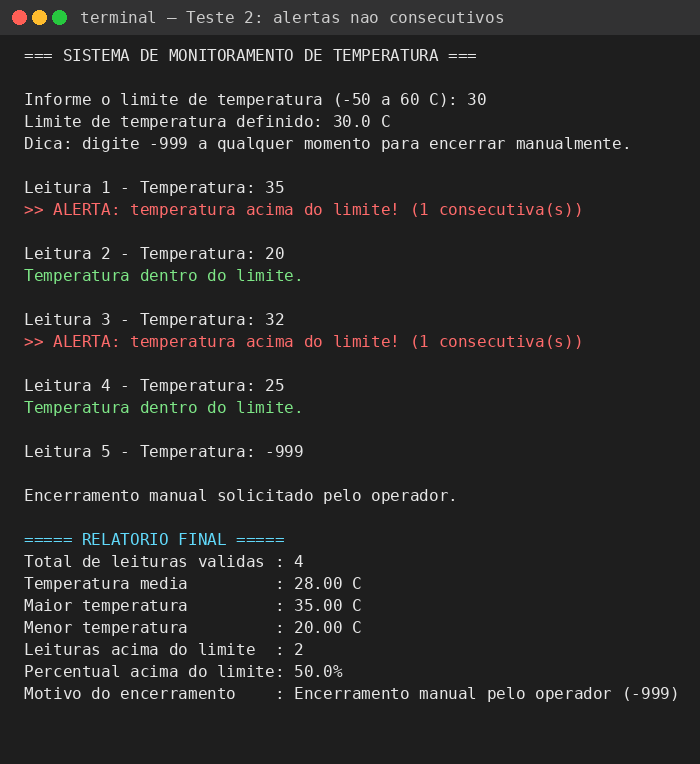
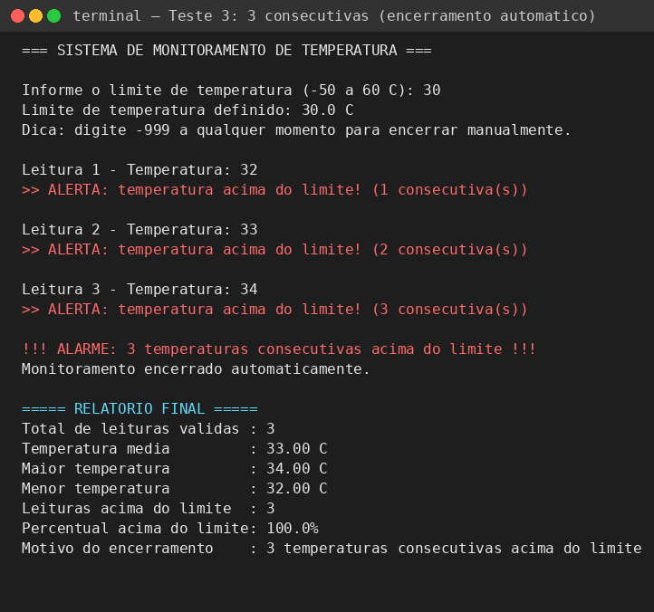

# Desafio: Sistema de Monitoramento de Temperatura

## 1. Identificação

- **Aluno:** Davi Carvalho Macedo
- **Disciplina:** Algoritmos e Pensamento Computacional
- **Professora:** Profa. Karla Sartin
- **Título do projeto:** Sistema de Monitoramento de Temperatura

## 2. Objetivo

O programa simula um sistema de monitoramento de temperatura (por exemplo, de um
ambiente, servidor ou processo industrial). O objetivo é receber leituras de
temperatura em tempo real, verificar se elas ultrapassam um limite definido pelo
usuário e emitir um alarme automático quando três leituras **consecutivas**
excedem esse limite — situação que indica um problema persistente e não apenas
um pico isolado. Ao final, o sistema apresenta um relatório estatístico das
leituras realizadas.

## 3. Funcionamento do programa

- **Definição do limite de temperatura:** logo no início, o programa solicita ao
  usuário um valor de limite (entre -50 °C e 60 °C). Essa pergunta é repetida
  enquanto o valor informado não for numérico ou estiver fora dessa faixa.
- **Realização das leituras:** após o limite ser definido, o programa entra em um
  laço de monitoramento, pedindo uma temperatura por vez ("Leitura 1", "Leitura
  2"...).
- **Tratamento de valores inválidos:** se o usuário digitar algo que não seja um
  número (por exemplo, letras), o programa exibe "Entrada inválida!" e pede a
  mesma leitura novamente, sem avançar o contador. Se o número digitado estiver
  fisicamente fora do esperado (fora de -50 a 100 °C, exceto o valor sentinela
  -999), a leitura é descartada com um aviso, também sem contar para as
  estatísticas.
- **Identificação de temperaturas acima do limite:** cada leitura válida é
  comparada ao limite definido. Se ultrapassar o limite, o programa exibe um
  alerta (`>> ALERTA: temperatura acima do limite!`).
- **Contagem de temperaturas consecutivas:** um contador (`consecutivasAcima`)
  é incrementado a cada leitura acima do limite e **reiniciado (zerado)** assim
  que uma leitura dentro do limite aparece — ou seja, só contam sequências
  ininterruptas de alertas.
- **Condição de encerramento:** o monitoramento é encerrado de duas formas:
  1. **Automaticamente**, quando o contador de consecutivas atinge **3** (alarme
     crítico); ou
  2. **Manualmente**, quando o operador digita o valor sentinela **-999**,
     simulando o encerramento voluntário do monitoramento (usado para testar
     cenários que não disparariam o alarme automático).

Ao final, independentemente do motivo do encerramento, é impresso um relatório
com total de leituras válidas, média, maior e menor temperatura, quantidade e
percentual de leituras acima do limite, e o motivo do encerramento.

## 4. Estruturas de repetição utilizadas

O programa usa **`do...while`** em dois pontos e **`while`** em um ponto,
combinando as duas estruturas:

- **`do...while` — leitura do limite de temperatura:** essa pergunta precisa ser
  feita **pelo menos uma vez**, então faz sentido executar o bloco primeiro e só
  depois checar se o valor é válido para decidir se repete.
- **`do...while` — leitura de cada temperatura individual:** pelo mesmo motivo,
  cada leitura precisa ser solicitada ao menos uma vez antes de sabermos se o
  valor digitado é numérico.
- **`while` — laço principal de monitoramento:** diferente dos casos acima, aqui
  a condição de continuar (`continuarMonitorando`) só é conhecida **depois** que
  uma leitura completa foi processada (é preciso verificar se houve alarme de 3
  consecutivas ou pedido manual de saída). Por isso usamos `while`, que testa a
  condição **antes** de decidir se executa mais uma rodada — incluindo o caso em
  que o monitoramento já deveria ter zero rodadas adicionais.

## 5. Como executar

```bash
gcc monitoramento.c -o monitoramento
./monitoramento
```

Durante a execução, digite o limite de temperatura e, em seguida, uma
temperatura por vez (pressionando Enter após cada valor). Digite `-999` a
qualquer momento para encerrar manualmente.

## 6. Testes realizados

### Teste 1 — Validação de entradas inválidas
**Entradas:** limite `abc` (inválido) → `30` (válido); leitura `xyz` (inválida)
→ `20` (válida); depois `-999` para encerrar.
**Resultado:** o programa rejeitou corretamente as entradas não numéricas,
pediu novamente sem travar ou encerrar, e só contabilizou a leitura válida (20
°C) no relatório final.


### Teste 2 — Temperaturas acima do limite, porém não consecutivas
**Entradas:** limite `30`; leituras `35, 20, 32, 25` (alternando entre acima e
abaixo do limite), depois `-999` para encerrar.
**Resultado:** cada leitura acima do limite (35 e 32) gerou um alerta com
contador reiniciado em "1", pois nunca houve duas leituras acima do limite em
sequência. O monitoramento **não foi encerrado automaticamente**, confirmando
que o contador de consecutivas é corretamente zerado a cada leitura dentro do
limite. Relatório final: 4 leituras, média 28.00 °C, 2 acima do limite (50%).


### Teste 3 — Três temperaturas consecutivas acima do limite
**Entradas:** limite `30`; leituras `32, 33, 34` (três seguidas acima do
limite).
**Resultado:** o contador de consecutivas subiu 1, 2 e 3, disparando o alarme e
o **encerramento automático** do monitoramento logo após a terceira leitura,
sem que o operador precisasse digitar `-999`. Relatório final: 3 leituras,
média 33.00 °C, 100% acima do limite, motivo "3 temperaturas consecutivas
acima do limite".


## Reflexão final

Optei por uma **combinação de `while` e `do...while`**, pois cada estrutura
resolvia um problema diferente do algoritmo. A diferença entre testar a
condição *antes* ou *depois* da execução foi decisiva em dois momentos:

Na leitura do limite e de cada temperatura, eu **sempre** preciso pedir o valor
ao usuário pelo menos uma vez antes de saber se ele é válido — não faz sentido
checar uma condição sobre uma variável que ainda não foi lida. Por isso usei
`do...while`: ele executa o bloco (pede o valor) e só **depois** avalia se deve
repetir, o que combina perfeitamente com "peça, valide, repita se inválido".

Já no laço principal de monitoramento, a situação é o oposto: a condição de
continuar depende de um resultado que só existe **depois** de uma leitura
completa ter sido processada (três alertas seguidos ou pedido manual de
saída). Usei `while` porque ele testa a condição **antes** de iniciar mais uma
rodada, permitindo que o laço pare exatamente no momento certo — logo após o
terceiro alerta consecutivo, sem precisar de uma leitura extra "desperdiçada"
só para descobrir que deveria parar. Se eu tivesse usado `do...while` aqui,
seria mais difícil evitar iniciar uma leitura desnecessária mesmo já sabendo
que o monitoramento deveria ter terminado.
